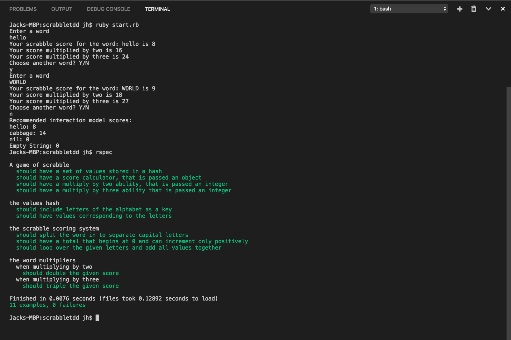

## Description 
***
Scrabble score simulator for a coding challenge as part of an application.

Developed entirely using RSpec and TDD. 

## To interact with the application
> Clone the repo, run 'ruby start.rb' in the folders main directory.

> Run the command 'rspec' to run the test suite. 

Or look at this pretty picture
