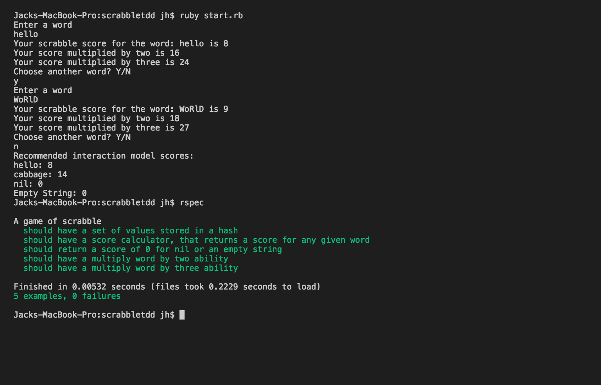

## Description 
***
Scrabble score simulator for a coding challenge as part of an application.

Developed entirely using RSpec and TDD. 

## To interact with the application
***
> Clone the repo, run 'ruby start.rb' in the folders main directory.

> Run the command 'rspec' to run the test suite. 

## Development Notes
***
I began writing tests to describe the behaviour of how a scrabble game should operate. Using TDD to create all classes and methods. 

However when I went back over to try and refactor and neaten the code I realised I wasn't actually testing the functionality of the code, I was testing the logic I was going to then input in to the methods. 

I came to the conclusion that values didn't need its own method and was more suited to a constant. I also cleaned up the syntax in the score method. 

I also realised many of my tests were doing the same thing or were just obsolete. I merged a few together and I removed some. Originally I had 11 examples, I now have 5.

Current Test Suite: 

Original Test Suite:
